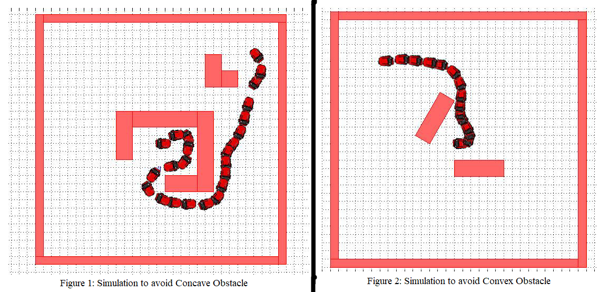

# Autonomous-Navigation-System-of-a-Mobile-Robot-in-an-Unknown-Environment
This repository contains my source code and implementation video of autonomous navigation system of a mobile robot. The proposed algorithms follow short and smooth trajectory. The algorithm we have used is a goal-oriented algorithm which always sets its path according to the location of the goal point. But in the wall following algorithm, while the robot is trying to follow a wall, certainly it does not know the outside of its disk abstraction. The robot takes the decision depending on the data it is receiving using sonar range sensors. But the sensor does not have a wide range. The robot takes the decision about its movement based on the clock-wise and counter-clock-wise direction vector multiplication. Therefore, sometimes it may travel more path than expected.

## Short Description of Each File
1. **pid_error_calculation.ino**-
2. **encoder_sonar_setup_with_previous.ino**-
3. **go_to_goal_algorithm_with_previous.ino**-
4. **obstacle_avoidance_algorithm_with_previous.ino**-
5. **follow_wall_algorithm_with_previous.ino**-

## Simulation Results
The algorithms proposed for navigation is efficient for both types of concave and convex obstacles. The robot does not suffer from local minima in any of the cases. The simulation results show the improvement over existing approaches like Follow the Gap Method (FGM), Vector Histogram (VFH) etc. We can also see that the proposed navigation algorithm is better than the A* search algorithm, Dijkstra's Algorithm or Grassfire Algorithm, which are used for navigation in a known environment.

Simulation result (Fig. 1) shows that the agent goes from point (0,0) to (1,1) following the concave obstacle wall to a certain condition and then tries to avoid the small obstacle and reaches the goal point. Simulation result (Fig. 2) shows that the agent goes from point (0,0) to (-1,1) point avoiding the convex obstacles and reaches the goal. It is to be noted that the simulation was done using [‘Sim.I.am’](https://www.mathworks.com/matlabcentral/fileexchange/40860-sim-i-am) which is a [MATLAB](https://www.mathworks.com/?s_tid=gn_logo) based mobile robot simulator developed by [GRITS laboratory](http://gritslab.gatech.edu/home/) of [Georgia Institute of Technology](https://www.gatech.edu/).

## Practical Implementation
For hardware platform a differential drive wheeled robot is made. There are two wheels which are controlled by DC motors and a caster ball at the front side for the balancing of the robot. Five Ultrasonic distance sensors are used in the front part of the robot to take the decision about the environment and wheel encoders are used to measure the rotation of wheel and using this information it estimates its position in the environment. The control mechanism is based on the processor [Arduino MEGA](https://store.arduino.cc/products/arduino-mega-2560-rev3). In our project we did not use any accelerometer. We were just depending on wheel encoder for localization. So drift is a major issue for this robot. One may use dead weight in the middle position of the wheels to get rid of drift.

### Practical Video of the Robot
1. [Go-To-Goal Behavior](https://www.youtube.com/watch?v=mx56AGjGusU) on YouTube
2. [Obstacles Avoidance Behavior](https://www.youtube.com/watch?v=s9AxqqOxT4g) on YouTube
3. [Go-To-Goal with Obstacles Avoidance Behavior Together](https://www.youtube.com/watch?v=MwT14vDychA) on YouTube
4. [Follow Wall with Obstacles Avoidance Behavior Together](https://www.youtube.com/watch?v=S0naiIBdsRg) on YouTube

## Acknowledgement
I have learnt a lot regarding control theory from the MOOC on [“Control of Mobile Robots”](https://www.my-mooc.com/en/mooc/control-of-mobile-robots/). It was taught by [Dr. Magnus Egerstedt](https://www.ece.gatech.edu/faculty-staff-directory/magnus-egerstedt-0).
